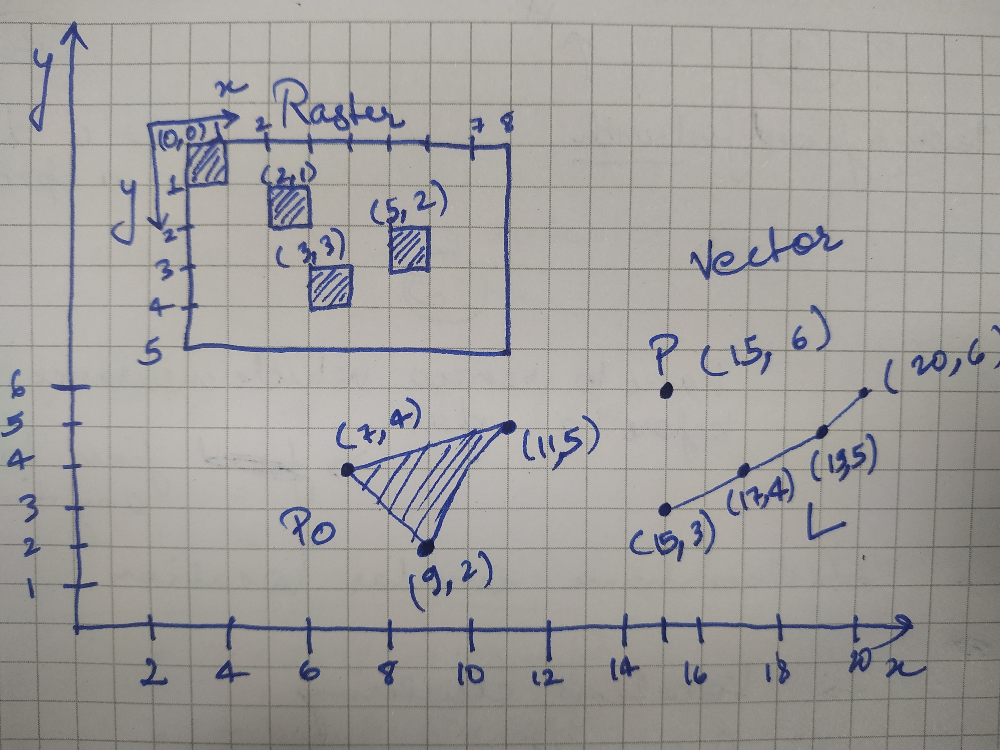

# Basics of Remote Sensing and GIS
| [Arnab Dutta](https://arnabdutta73.github.io/) |&nbsp;<a
href="https://twitter.com/arnabdutta73"> &nbsp;<a
href="https://www.linkedin.com/in/arnab-dutta/">
&nbsp;[:octocat:](https://github.com/arnabdutta73)
&nbsp;[:email:](mailto:arnabdutta73@gmail.com)|

## Remote Sensing

As we can see in the name itself, Remote Sensing is the study of objects which are sensed through sensory devices remotely, i.e., without
physically touching. Eyes and ears in the body are a good example of
remote sensing organs. Some more examples include camera, LiDAR, RADAR,
SONAR, etc.

### Types of sensors
There are two types of sensors:
- Active Sensors
- Passive Sensors

##### Active Sensors
Active sensors are devices which have their own source of emission which
then they sense and collect data. LiDAR, RADAR, SONAR are few of the
examples.

##### Passive Sensors
Passive sensors are devices which sense emissions sourcing from outside
objects. Camera is one of the example of passive sensing device.

### Types of remote sensing
There are majorly three types of remote sensing performed:
- Ground based
- Areal
- Satellite based

##### Ground based
The carrier of the sensors are placed on the earth to capture the data.
Terrestrial LiDAR is an example.

##### Areal
The carrier is an object which is in the air while the data is
collected. Drones, Aeroplanes are two of the examples of carriers.

##### Satellite based
Satellites are the carrier of the sensors. All the sensor needed are
placed strategically on the satellite and then they are sent to orbit
the earth.

## Geographic Information System

Any information related to earth's surface is called geographic
information. The system that handles the data and information of
earth's surface is called as Geographic Information System or in short
'GIS'.

By using Remote Sensing, we collect data and perform GIS related
operations on them. Some examples of GIS based application sectors
include urban planning, agriculture, IT, forestry, etc.

## Types of datasets

There are majorly two types of data that we are going to deal with in
this context. 
- Raster Data
- Vector Data

### The main difference:
Raster data is basically images with fundamental element being a
'pixel'. Whereas, in Vector data, the fundamental element is a point.

Sample raster image vs Vector data structure:
 
 

Figure 1: Comparision of Raster and Vector Datasets

As could be seen from the image above, Raster image has a different
coordinate system than Vector data. All the pixels grouped together form
a raster image. 

In the image above, inside vector label, `P` is a point with coordinates
(15, 6), `L` is a line where there are 4 points and `Po` is a polygon
enclosed with three points.

### Projection
Projection, in general, means viewing an object residing in a higher dimensional system from a lower dimensional system. When we see the world, we view it in 3D, however, when we create a map, it is in 2D. Maps are the projection of 3D world onto a 2D system.
In Figure 1, we see that the coordinate system is a local system where
(0,0) is the origin. When this coordinate system is transformed into
some other system its called Projection.

### Geo-referencing
When the projection is done specifically to the earth's coordinate
system, its called geo-referencing.

[This website](https://www.gistda.or.th/main/en/node/950) gives the
types of projections for the earth coordinate system.

