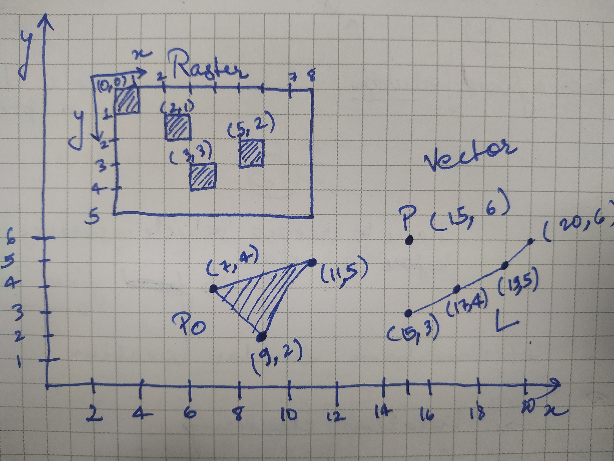

# Basics of Remote Sensing and GIS

## Remote Sensing

As we can see in the name itself, Remote Sensing is study and
application of sensory devices which senses remotely, i.e., without
physically touching. Eyes and ears in the body is a good example of
remote sense organs. Some more examples include, camera, LiDAR, RADAR,
SONAR, etc.

## Geographic Information System

Any information related to earth is called as geographic information.
The system that deals with the data and information of earth is called
as Geographic Information System or in short 'GIS'.

## Types of datasets

There are majorly two types of data that we are going to deal with in
this context. 
- Raster Data
- Vector Data

### The main difference:
Raster data is basically images with fundamental element being a
'pixel'. Whereas, in Vector data, the fundamental element is a point.

Sample raster image vs Vector data structure:
 
 

As could be seen from the image above, Raster image has a different
coordinate system than Vector data. All the pixels grouped together form
a raster image. 

In the image above, inside vector label, `P` is a point with coordinates
(15, 6), `L` is a line where there are 4 points and `Po` is a polygon
enclosed with three points.